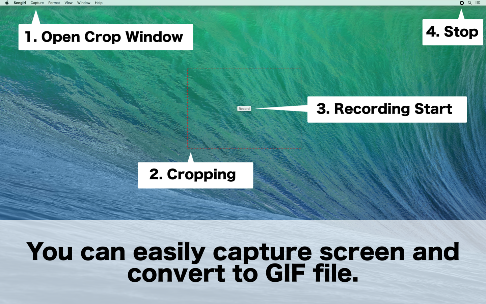
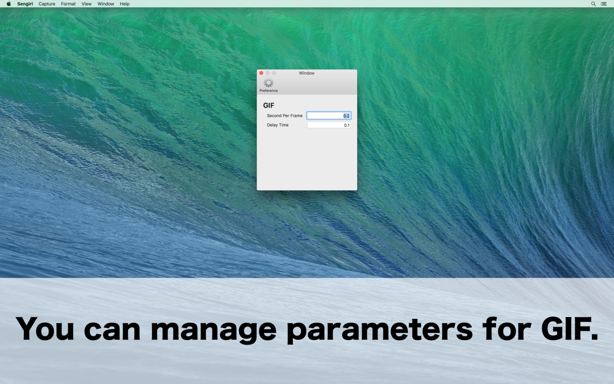

# Sengiri

" Sengiri " from the screen recording until the animated GIF file , you can create as soon as a simple operation .
Sengiri, in English, is the shred.

## Features

- You can specify a screen recording can area.
- You can automatically be cropped to the top window.
- You can stop video recording from the status menu.
- Each operation will correspond to the shortcut.

## ScreenShots

## Author

- [nakajijapan](https://github.com/nakajijapan)

## License

Sengiri is copyrighted free software by nakajijapan.
You can redistribute it and/or modify it under the terms of [the GPL version 2](https://github.com/psychs/limechat/blob/master/GPL.txt).
